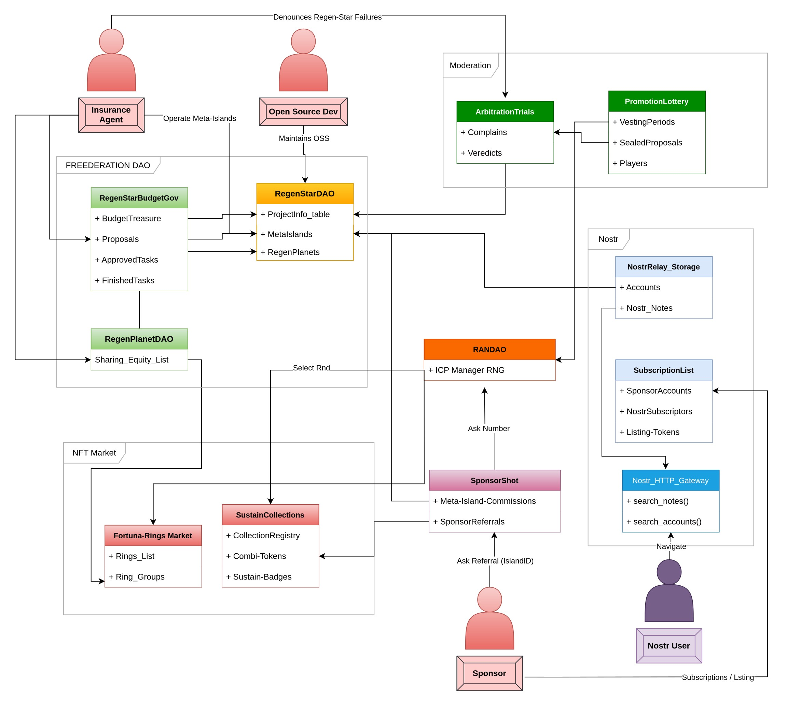

# Arquitectura

FREEDERATION se compone de 9 subsistemas:

1) **Regen-Star DAO**: Constituye el repositorio de Franquicias de Responsabilidad Mutua, las organizaciones jerárquicas centradas en las Regen-Star que subscriben a los Regen-Planets, y éstos a su vez contienen las Meta-Islas.
Las franquicias de las Regen-Star poseen una gobernanza de participación en 2 niveles donde los Regen-Planets ejercen como agentes de afiliación y supervisión de los agentes asociados de las Meta-Islas.

2) **Regen-Star Budget Governance**: Gestiona la participción de gobernanza y la asignación presupuestal de financiación de tareas dentro de las Regen-Star. Cada miembro de la gobernanza, las Meta-Islas, tienen poder de voto o veto sobre las propuestas de desarrollo y asignación de recursos.
Este subsistema también maneja el seguimiento de las tareas de desarrollo a financiar, así como la asignación del presupuesto priorizado y los mecanismos de aprobación de tarea cumplida.

3) **SponsorShot**: Gestiona la interacción entre Sponsors y las Meta-Islas, procesando el pago por catalogación y posicionamiento de contenidos del patrocinador (Sponsor). 
Mediante éste proceso, el Sponsor obtiene un paquete de Listing-Tokens, como también de NFTs promocionales otorgados a discreción del proyecto de la **Regen-Star** correspondiente.

4) **Tribunales de Arbitraje**: Gestiona los casos de disputas contra la gestión de las Regen-Planets. Se compone de un mecanismo de denuncias que relaciona publicaciones de Nostr detallando el pliego de cargos y el hilo de discusión, con el registro de los casos interpuestos, registrado como un formulario con detalles sobre el tipo de falta y la entidad acusada.

5) **Lotería de Promoción**: Un sistema de votación y un sorteo aleatorio en el que participan los operadores de las Meta-Islas. Para participar, los operadores deben enviar sus propuestas selladas a un Banco de Veredictos. Cada VestingPeriod, la DAO de FREEDERATION genera un número aleatorio on-chain, no predecible pero verificable, que se utiliza para seleccionar al azar una propuesta sellada del Banco de Veredictos.

6) **Sustain-Collections** : Gestiona las colecciones de tokens combinables Combi-Tokens, registrados y licenciados en cada proyecto Regen-Star como Sustain-Collections.
Cada Sustain-Collection define los parámetros de generación aleatoria como el subgrupo de Combi-Token y el número de series para conformar CombiSets.
Establece también el tipo de token Sustain-Badge, que se obtiene al conformar CombiSets.

7) **Fortuna-Rings Market**: Los Fortuna-Rings son un tipo especial de Combi-Tokens, relacionados con una Regen-Star correspondiente.
El mercado de Fortuna-Rings permite a los coleccionistas conformar grupos CombiSet de 5 anillos para obtener un PlanetMintingToken, que les permitirá acular un Regen-Planet.

8) **Regen-Planets DAO**: La conformación de un Regen-Planet establece  la participación de equity según acuerden los dueños de los anillos que participan en la conformación de un CombiSet.
Este sistema de Equity establece el reparto de regalías por el recaudo de comisiones de las actividades de un Regen-Planet.
De manera análoga, el contrato que controla la gestión de los Regen-Planets gestiona meta-datos de su registro, y los parámetros de emisión de Meta-Islas con su curva de precios.

9) **FREEDERATION Nostr-Relay Storage**: Un Canister dedicado a soportar la funcionalidad básica de servicios en Nostr, con respecto al respaldo de información de las cuentas y publicaciones en formato JSON. Gestiona el respaldo de publicaciones Nostr en un contrato inteligente para su almacenamiento descentralizado.
Tiene la funcionalidad de una base de datos de almacenamiento que se puede consultar por identificadores de cuenta y de publicaciones, así como entregar listados de publicaciones asociadas a etiquetas.
También gestiona el registro de utilización de Listing-Tokens en beneficio de un Sponsor con respecto a las subscripciones de miembros VIP a las cuentas de las Meta-Islas, favoreciendo su visibilidad en los motores de búsqueda.