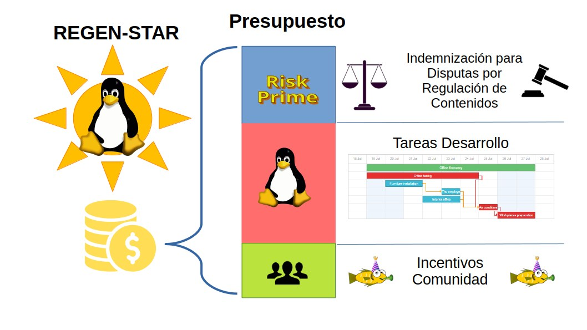

# Recaudo de Fondos en la Regen-Star

Las Regen-Star recaudan fondos de las siguiente fuentes de ingresos:

- `A`. **De la venta inicial de Regen-Planets**: Inicialmente, cuando se crea una Regen-Star asociada a un proyecto Open Source, ésta realiza una venta inicial de tokens de Regen-Planets que se ofrecen a los primeros inversores del proyecto, los Early-Adopters. De esta venta inicial el proyecto obtiene los recursos para promover la evolución de su proyecto.

- `B`. **De la venta de Meta-Islands**: los administradores de los Regen-Planet establecen el precio de los tokens NFT correspondientes a las Meta-Islands. Un ingreso base se destina a la Regen-Star para financiar el desarrollo del proyecto Open Source. El excedente es capturado por el Regen-Planet a modo de comisión de venta.

- `C`. **De los SponsorShots**: Los operadores de las Meta-Islands recaudan un pago por el servicio de promoción de publicaciones. Un ingreso base se destina a la Regen-Star para financiar el desarrollo del proyecto Open Source. El excedente es capturado por la Meta-Island y su Regen-Planet a modo de comisión de venta.

### Deducción del impuesto de FREEDERATION

De las actividades comerciales `A`, `B` y `C`, se descuenta un porcentaje de impuesto que contribuye al Fondo de Gobernanza de FREEDERATION:
- En el caso de `A` (venta inicial de Regen-Planets), la Regen-Star ha de recaudar lo suficiente en impuestos para pagar una **Cuota de Acreditación** a FREEDERATION. 
- En `B` y `C`, que corresponden a las actividades comerciales de la Regen-Star, el impuesto corresponde a la Cuota de Promoción que permite el ascenso instantáneo del proyecto al aumentar su Prestigio cada VestingPeriod.

### Distribución de Fondos en la Regen-Star

El concepto de negocio basado en el aseguramiento de compromisos y supervisión de los miembros asociados, garantiza ingresos constantes para financiar el mantenimiento y desarrollo del proyecto de Bienes Públicos (incluyendo Open Source) a cargo de la Regen-Star.
Los fondos recaudados se reparten en 3 rubros:
- **Fondo de Desarrollo**:  El Rubro destinado al Presupuesto de Bienes Públicos y Open Source. Por defecto, se destina el 60% de los ingresos a éste fondo para financiar tareas de desarrollo y recompensas para incentivar a voluntarios de la comunidad que contribuyan con labores.
- **El Fondo de Cobertura de Riesgos**: Este fondo garantiza la liquidez para responder a las acusaciones contra el proyecto en temas de moderación de contenido y legitimidad del desarrollo del proyecto de bienes públicos. De éste fondo se pagarán sanciones económicas que van a ser recolectados en los fondos de la Lotería de Promoción para futuros premios.
- **Fondo de Comunidad**: Un pequeño porcentaje se destina a financiar actividades de la comunidad, eventos sociales y beneficios que son propuestos en la gobernanza de la comunidad de la Regen-Star.
___

