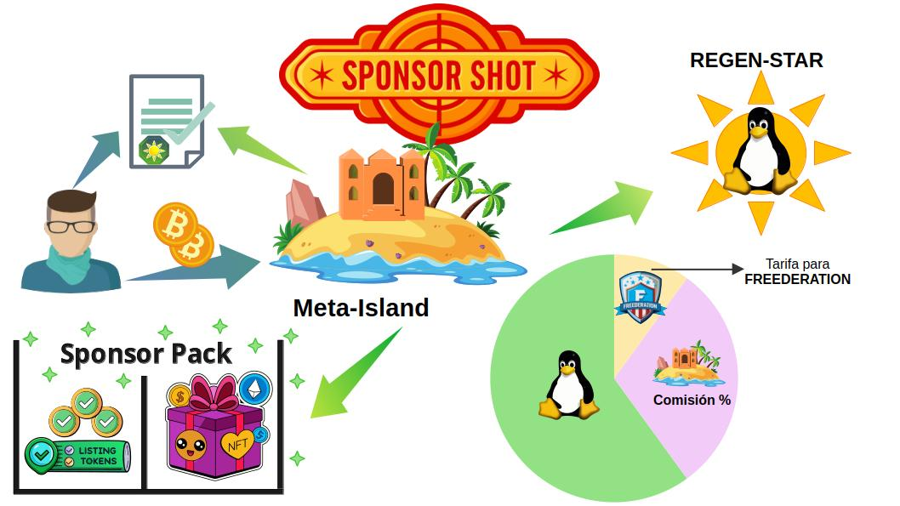
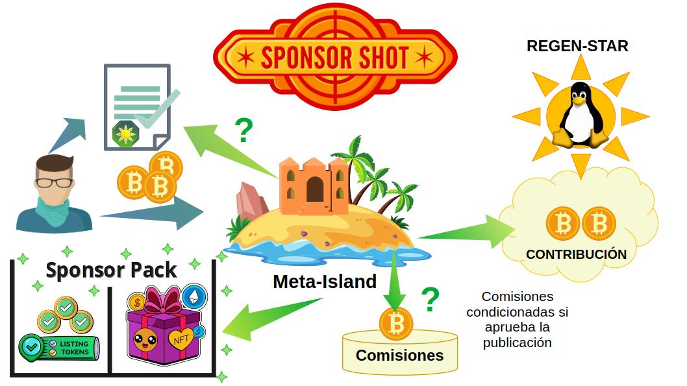

# SponsorShots: Patrocinio y Catalogación

El proceso del **SponsorShot** establece el recaudo financiero que las **Regen-Star** requieren para gestionar el desarrollo y mantenimiento de los proyectos Open Source. Las Meta-Islas asociadas a un Regen-Star ayudan a la distribución de los tokens del **SponsorPack** (**Combi-Tokens** y **Listing-Tokens**), y gestionan el proceso de promoción de contenidos con sus patrocinadores (Sponsors).

Los **SponsorShots** son la alternativa de los [**Zaps de Nostr**][zaps_info], con el beneficio adicional de que contribuyen a la sostenibilidad de Bienes Públicos y Open Source. De forma similar al fenómeno del [**Zapvertising**][zapvertising] en Nostr, los patrocinadores aportarán una contribución económica a las Meta-Islas que ofrecen contenido de calidad y demuestran un interés genuino de su audiencia.

## Recaudo y Prevención del Fraude

El aspecto clave es que a partir del recaudo de cada SponsorShot, una parte se destina al [**Fondo Común**][regen_star_treasure] de la **Regen-Star**. Otro porcentaje se destina a **Fondo de Gobernanza de FREEDERATION**. Y del monto restante se deduce una comisión. Esta comisión se reparte de la siguiente manera:

-  Un porcentaje de la comisión se retribuye al Regen-Planet supervisor de la Meta-Isla, según el parámetro de tarifa de recaudo establecido por la gobernanza del Regen-Planet. Usualmente es el 10%.
- El resto de la comisión corresponde al dueño de la Meta-Isla (90%).

___

___

Este sistema de reparto de los SponsorShots brinda mecanismos para prevenir el fraude prevalente en el previo sistema de los Zaps en Nostr: se corrige el [**problema de las auto-donaciones**][zaps_fraud] que manipulan los puntajes de relevancia  y fomentan esquemas de confabulación entre cuentas.

La filosofía de la prevención del fraude de la auto-promoción consiste en impedir que el atacante recupere los fondos invertidos en [**Zaps fraudulentos**][zaps_fraud]. Por ende, los fondos de promoción recaudados con los SponsorShots deben destinar una contribución al beneficio de un proyecto de Bienes Públicos, el cuál ha sido avalado por la comunidad y autorizado por la DAO de FREEDERATION.

Gracias al mecanismo de los SponsorShots.  se garantiza una contribución recurrente al proyecto de Bienes Públicos y Open Source. Al mismo tiempo se constituye como una medida de prevención de fraude.

## Reputación de la Meta-Isla y SponsorShots

La contribución de los SponsorShots aumenta el valor social de la actividad de la Meta-Isla. Precisamente, porque respalda el mérito de contribuir con un genuino proyecto que beneficia a la sociedad, y se refleja directamente en su puntaje de Reputación.

Esa relación entre la Reputación de la Meta-Isla, la legitimidad del proyecto de Bienes Públicos liderado por la Regen-Star, y el compromiso con la calidad de contenidos otorgan un valor especial
al inversor o patrocinador.

## Interacción en los SponsorShots

A cambio de su contribución económica en el SponsorShot, el inversor obtiene un reconocimiento único, el **SponsorPack**: Un paquete de NFTs que adquiere importancia en futuras actividades comunitarias dentro de las Meta-Islas.
___

___
Cabe destacar que a través de la operación del SponsorShot se establece un mecanismo de comunicación privado donde el patrocinador propone publicaciones para ser promovidas y catalogadas por la Meta-Isla.

La Meta-Isla que recibe un SponsorShot, tiene la potestad de elegir si aceptar el encargo del patrocinador o simplemente otorgar el paquete de NFTs (**SponsorPack**), según la siguiente casuística:

- `A`.  Si acepta, se gana una comisión del ingreso del SponsorShot. 
  - `A.1`. Prepara una publicación en borrador y la presenta al patrocinador para confirmar el encargo.
  - `A.2`. El patrocinador firma digitalmente la aceptación del encargo, autorizando el pago de la comisión extra incluída en el SponsorShot para la Meta-Isla.

- `B`.  Si NO acepta el encargo, la comisión del SponsorShot se destina enteramente al fondo común del Regen-Planet. 

- `C`. Los SponsorShots sin encargo simplemente otorgan un paquete de NFTs (SponsorPack) y entregan una contribución opcional a la Meta-Isla.

En todos los casos (`A`, `B`, `C`) El patrocinador recibe el SponsorPack que consiste en un grupo de NFTs promocionales (**Combi-Tokens**), mas un número fijo de **Listing-Tokens** (5 por defecto).

[zaps_info]:https://nostr.how/es/zaps
[zapvertising]:https://franciscolen.substack.com/p/monetizacion-y-mercadeo-digital-en
[regen_star_treasure]:economy01.md
[zaps_fraud]:../motivation/motivation04.md