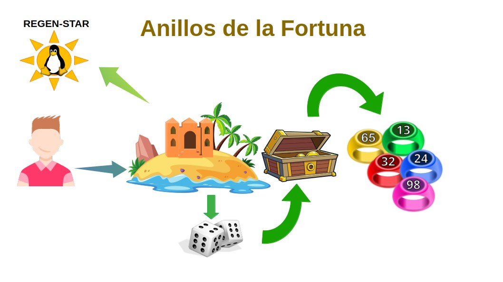
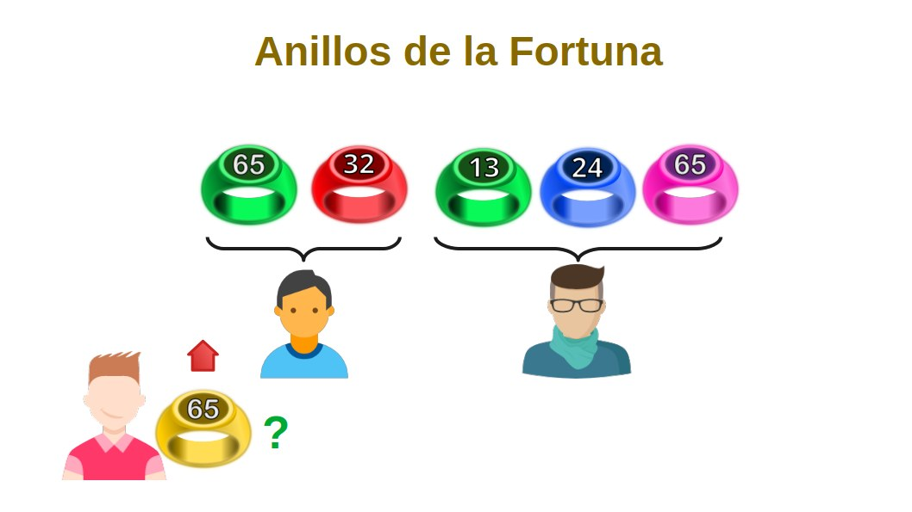
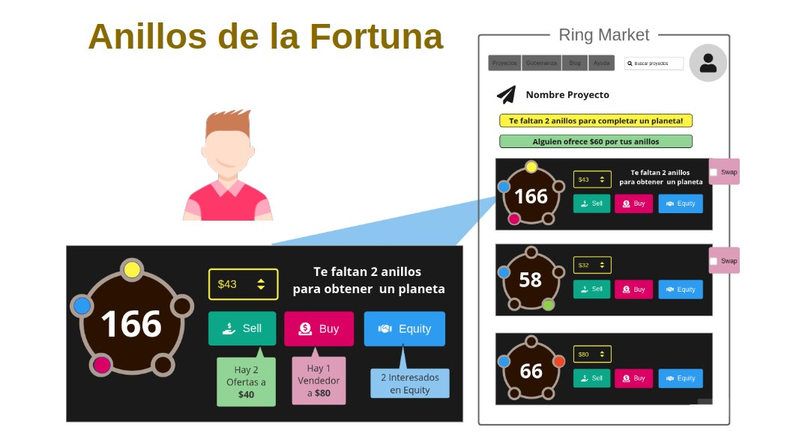
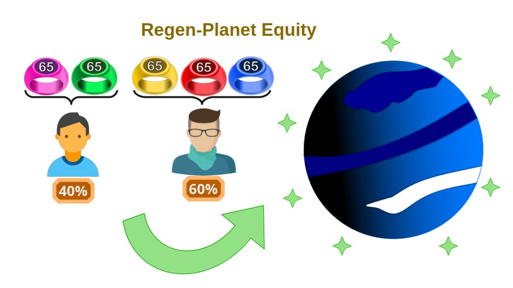

# Los Anillos de la Fortuna: Innovación en NFTs Combinables para la Expansión de las Regen-Star

Los **Anillos de la Fortuna** (Fortuna-Rings) son una adaptación de los **Combi-Tokens**, diseñados específicamente para facilitar el proceso de acuñación de nuevos **Regen-Planets** dentro del ecosistema de las **Regen-Star**. Estos tokens se ofrecen a los inversores asociados como una recompensa por su participación y gestión en el proyecto Open Source.

### Características de los Anillos de la Fortuna

- **Generación Aleatoria**: Utilizando la tecnología de los Combi-Tokens, cada Anillo de la Fortuna es generado aleatoriamente por la DAO de FREEDERATION, combinando colores y números de serie únicos.
- **Conjuntos de Anillos**: Los tokens se agrupan en conjuntos de cinco anillos, cada uno de un color distinto.
- **Intercambio y Colección**: Los operadores de las Meta-Islas pueden intercambiar estos anillos en el mercado de FREEDERATION, buscando completar grupos de cinco anillos de la misma serie pero de colores diferentes.

## Proceso de Adquisición y Utilización

___
Cuando un operador adquiere una **Meta-Isla** dentro de un **Regen-Planet**, recibe un **Cofre de Tesoro** que contiene cinco Anillos de la Fortuna generados aleatoriamente. Estos anillos pueden ser intercambiados en el mercado de piezas NFTs combinables de FREEDERATION. El objetivo de los coleccionistas es completar secuencias de anillos de la misma serie.

### Recompensas y Beneficios

Los coleccionistas que logran completar una secuencia de anillos de la misma serie reciben como recompensa un nuevo **Regen-Planet**. Este mecanismo no solo incentiva la participación activa en el ecosistema, sino que también promueve la colaboración y el intercambio entre los miembros.
___

___

## Herramientas y Facilitación por FREEDERATION

FREEDERATION ofrece un conjunto de herramientas para facilitar la coordinación entre compradores y vendedores de piezas:
- **Mercado de Intercambio**: Los usuarios pueden intercambiar anillos utilizando las herramientas de mercado de FREEDERATION.
- **Subastas y Trueques**: La plataforma permite subastar precios y establecer trueques para completar colecciones.
- **Acuerdos de Asociación**: Los operadores pueden establecer acuerdos de gestión compartida de los Regen-Planets mediante acuerdos de Equity.
___

___

### Distribución de Beneficios Equity

La participación en la formación de nuevos Regen-Planets a través de los Anillos de la Fortuna permite a los socios obtener un porcentaje de los derechos sobre los futuros beneficios económicos del Regen-Planet. El porcentaje de estos derechos está directamente relacionado con la cantidad de anillos que cada socio contribuye a la formación del Regen-Planet.
___

___

## Conclusión
El sistema de **Anillos de la Fortuna** de la DAO de FREEDERATION representa una innovación significativa en el uso de NFTs combinables. Este modelo no solo facilita la expansión del ecosistema de Meta-Islas y Regen-Planets, sino que también ofrece a los inversores y operadores una oportunidad única de obtener recompensas y beneficios económicos.

A través de la plataforma FREEDERATION, se proporcionan las herramientas necesarias para fomentar la colaboración y el intercambio, asegurando así un crecimiento sostenible y mutuamente beneficioso para todos los participantes del proyecto.