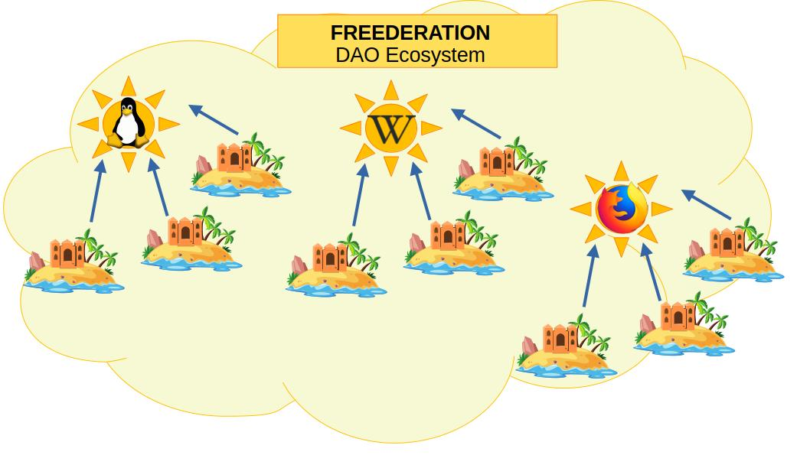

# Franquicia de Responsabilidad Mutua

Con base en la descripción general del concepto de Franquicia de Responsabilidad Mutua para proyectos Open Source (detallada en el capítulo de [**Propuesta de Valor**][valueproposal_franchise]) , este capítulo profundizará en la interdependencia de funciones y responsabilidades entre los Agentes de Aseguramiento y los Administradores del Proyecto Open Source. Estas dos figuras operan bajo la estructura de la Franquicia de Responsabilidad Mutua, representada por una Regen-Star.
___

___

 - [**Regen-Star : Organización que Respalda Esfuerzos Colectivos**][regen_star].
 - [**Meta-Island: Estandarte de la Relevancia del Contenido.**][meta_island].
 - [**Regen-Planets: Agentes de Afiliación.**][regen_planet].

[valueproposal_franchise]:../valueproposal/valueproposal01.md
[regen_star]:regen_star.md
[meta_island]:meta_island.md
[regen_planet]:regen_planet.md
