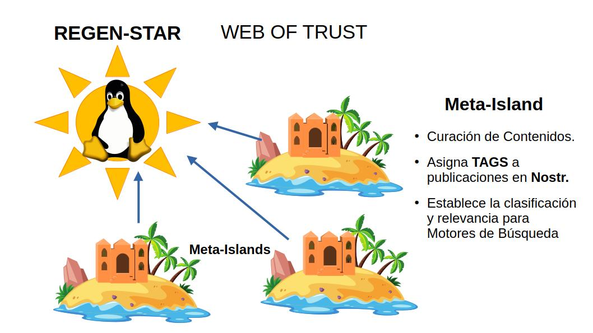

# Meta-Island: Estandarte de la Relevancia del Contenido.

Las Meta-Islas ejercen la labor de **Curación de Contenido**, se encargan de agregar y catalogar información de calidad apoyados en la garantía que les otorga el Prestigio de la Regen-Star.

En redes sociales descentralizadas como Nostr, los canales de publicaciones asociados a las cuentas de usuarios adquieren relevancia en los motores de búsqueda. Estos direccionan mecanismos de indexación a medida que las publicaciones referencian contenido con descripciones coherentes y catalogan adecuadamente mediante Etiquetas y Menciones. 

Un problema existente en **Nostr** es que se permite a las cuentas maliciosas confundir a los internautas. Debido a la apertura del protocolo descentralizado de Nostr, nada impide la asignación de referencias erróneas a contenido que no corresponde a las temáticas en cuestión. Se induce a fraudes, publicidad engañosa y promoción no deseada. Tal práctica abusiva constituye una forma de Spam que arruina la experiencia de los usuarios y los expone a peligros informáticos.

Como solución, FREEDERATION otorga a las Meta-Islas el rol de Cuentas Importantes que direccionan la información relevante y de calidad para facilitar las búsquedas. Así se facilita el descubrimiento de contenido en el protocolo Nostr. 

En contraprestación, las Meta-Islas están supervisadas por la comunidad en la cuál están vinculadas velando por preservar la reputación colectiva del proyecto. Están sujetas al escrutinio de los **Tribunales de Arbitraje** orquestados por la DAO de FREEDERATION.

## Catalogación y Curación de Contenidos

El compromiso con la calidad y la integridad de información, convierte a las Meta-Islas en el vehículo por excelencia para promover contenido y optimizar las búsquedas. 

Tales esfuerzos en consolidar contenido relevante y verídico se ven recomendados con una mayor apreciación de la Meta-Isla como lugar común donde confluyen usuarios interesados en los mismos tópicos. 

Esa apreciación de la comunidad conlleva a un interés estratégico de los patrocinadores que invertirán en servicios de posicionamiento de búsquedas y promoción de contenidos afines. De esa manera se asegura una fuente constante de ingresos para el operador de la Meta-Isla como para el proyecto de la Regen-Star.

La integración de las Meta-Islas a Nostr involucra funciones de etiquetado de publicaciones y referenciación de artículos en un feed asociado a una cuenta de Nostr. Tal cuenta se relaciona con la Meta-Isla en la DAO de FREEDERATION.

### Interacción con los Sponsors

Las Meta-Islas, al desempeñarse como lugares de referencia en la interacción con Nostr, ofrecen a los patrocinadores (Sponsors) un valor agregado en la promoción de sus contenidos.

Las Meta-Islas establecen un mecanismo de interacción con los Sponsors mediante el cuál monetizan su servicio de catalogación y posicionamiento de contenidos, a cambio de un aporte económico. El proceso de [**SponsorShot**][sponsorshot] ofrece a los patrocinadores un paquete de tokens que habilitan funciones de valor agregado para éstos. 

### Relevancia y Reputación
 
El valor de la relevancia del contenido de la Meta-Isla se refleja en un puntaje de Reputación el cuál se deriva del Prestigio de la Regen-Star como de la cantidad de contribuciones de los sponsors ([SponsorShots][sponsorshot]).

Para manifestar el aspecto de reputación colectiva, se utiliza el Prestigio de la Regen-Star como factor de la ecuación, y se atenua la cantidad de SponsorShots de manera logarítmica.

[$%
\text{Reputation}_{Meta-Island} = \text{Prestige}_{Regen-Star} \times log_2 \left( \text{SponsorShots}_{count} \right) 
%$]

Cabe resaltar que las Meta-Islas sólo incrementan su puntaje de Reputación positivamente. Pues en caso de fallar en sus compromisos se liquida y elimina el activo que representa la Meta-Isla afectada.

El riesgo de perder la Meta-Isla por mal comportamiento y negligencia, la convierte en un colateral para respaldar compromisos financieros y de prestación de servicios.

[sponsorshot]:../economy/economy03.md