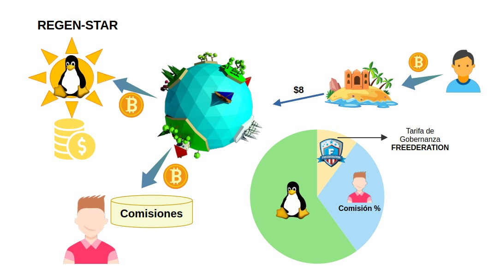
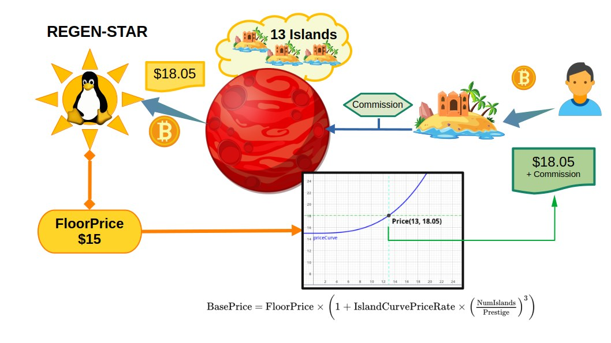
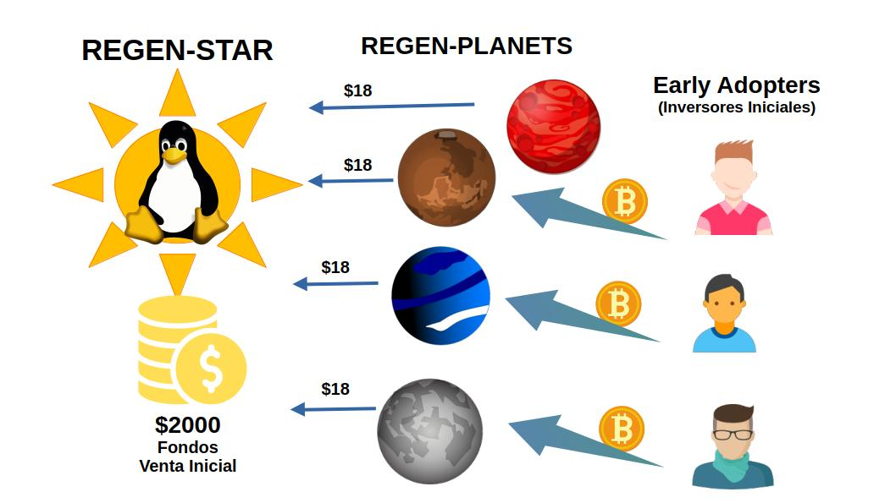

# Regen-Planets

En cada franquicia Regen-Star, los Regen-Planets se erigen como los pilares fundamentales que facilitan la expansión y el crecimiento de la red. Estos actúan como agentes de afiliación, ofreciendo a los aspirantes la oportunidad de unirse a la franquicia y establecer sus propias Meta-Islas. 

___

___

### Supervisión y Control de las Meta-Islas

Los Regen-Planets tienen la responsabilidad de supervisar las actividades de las Meta-Islas bajo su jurisdicción. Esta supervisión es esencial para garantizar el cumplimiento de las normativas establecidas por la franquicia Regen-Star. En caso de incumplimiento, los Regen-Planets tienen la autoridad para tomar medidas disciplinarias que incluyen:

- **Bloqueo de Operaciones:** Suspensión temporal de las actividades de una Meta-Isla.
- **Revocación de Membresía:** Cancelación unilateral de la membresía del propietario de la Meta-Isla y retiro del token que acredita la titularidad de la Meta-Isla.

Estas medidas aseguran que las operaciones dentro de las Meta-Islas se mantengan dentro de los estándares requeridos, protegiendo la integridad de la franquicia Regen-Star.

### Incentivos para la Supervisión
Los Regen-Planets están motivados a ejercer una supervisión diligente sobre las Meta-Islas debido a los beneficios económicos derivados de su correcto funcionamiento. Los Regen-Planets comparten las comisiones de ventas generadas por las Meta-Islas a su cargo, creando una fuente de ingresos constante y significativa. Esta estructura de incentivos asegura que los Regen-Planets se mantengan proactivos en la vigilancia y apoyo de sus Meta-Islas.

## Creación y Venta de Meta-Islas
Cuando una Meta-Isla es vendida a un aspirante a miembro de la franquicia, el Regen-Planet recibe una comisión de venta. Y el restante de los ingresos se destina al sostenimiento de la Regen-Star cuya cotización se establece por el Precio-Base, el cuál se obtiene de la curva de precios de emisión de Meta-Islas. Este sistema de comisiones asegura que tanto los Regen-Planets como la Regen-Star obtengan beneficios de cada transacción, promoviendo un modelo de negocio sostenible.

### Cálculo del Precio de la Meta-Isla
El precio de una Meta-Isla se determina mediante una fórmula que considera tanto el Precio-Base como la Comisión destinada al Regen-Planet. El Precio-Base se calcula utilizando una fórmula de curva de exponente cúbico, ajustada de acuerdo a la cantidad de Meta-Islas ya emitidas dentro del Regen-Planet. Los parámetros de esta fórmula son establecidos por la Regen-Star, y se definen como sigue:

- **FloorPrice:** Precio mínimo base.
- **IslandCurvePriceRate:** Factor de incremento de curva.
- **CurveFactor:** Definido como el número de islas emitidas dividido por el prestigio del Regen-Planet.

La fórmula para el Precio Base es:

[$%
\text{PrecioBase} = \text{FloorPrice} \times \left( 1 + \text{IslandCurvePriceRate} \times \left( \frac{\text{NumeroIslas}}{\text{Prestigio}} \right)^3  \right)
%$]

El incremento dinámico del Precio Base está diseñado para limitar la emisión de nuevas Meta-Islas, creando un efecto de escasez controlada que fomenta una competencia saludable entre diferentes Regen-Planets. Este mecanismo asegura que el mercado de Meta-Islas se mantenga equilibrado y atractivo para nuevos inversores.

Cabe resultar que el parámetro de **Prestigio** utilizado por el Regen-Planet creado no es el mismo parámetro global de su Regen-Star. En su lugar, se asigna un valor de Prestigio instanciado que refleja el estado de la Regen-Star en el momento de la creación del Regen-Planet.

El objetivo de tal política es garantizar que, a medida que el proyecto adquiere madurez y demuestra su compromiso con la calidad, se le permita incorporar más agentes asociados. Es decir, que los Regen-Planets acuñados en generaciones futuras adquieran una mayor capacidad de producción de Meta-Islas que sus predecesores. Así se mejora su competitividad incentivando un crecimiento orgánico y sostenido de la franquicia.

### Recaudación de Fondos por Actividad Económica

Los Regen-Planets también recaudan fondos provenientes de la actividad económica de las Meta-Islas, especialmente en la monetización de servicios y contenidos patrocinados. Mediante el proceso conocido como **SponsorShot**, las Meta-Islas pueden atraer patrocinadores (Sponsors) para financiar sus actividades. Los ingresos generados a través de SponsorShot se distribuyen de la siguiente manera:
- Un porcentaje se destina a proyectos de software de código abierto (Open Source), fomentando así el desarrollo y la innovación tecnológica dentro del ecosistema Regen-Star.
- De la comisión de venta obtenida por la Meta-Isla a través del SponsorShot, un porcentaje se distribuye como regalía al Regen-Planet.

## Creación de los Regen-Planets

Los Regen-Planets son inicialmente adquiridos por los Early-Adopters, los primeros inversores en el proyecto Regen-Star. Estos inversores obtienen sus Regen-Planets a través de una venta inicial de tokens, coordinada por la Regen-Star en su fase de fundación. La cantidad de tokens emitidos es limitada, lo que garantiza exclusividad y valor a estos activos iniciales.

Cuando el fundador de una Regen-Star inscribe su proyecto, también define los parámetros de la venta inicial de Regen-Planets para su venta inicial. Esta información especifica:

| Atributo        | Descripción                                                                 |
|-----------------|-----------------------------------------------------------------------------|
| **FounderPlanetReserve**       | Cantidad de Regen-Planets reservadas para el fundador.      |
| **InitialPlanetMintingCount**    | Cantidad total de Regen-Planets a ofrecer en la venta incial   |
| **PlanetMintingPrice**      | Precio de venta del ofrecimiento inicial de Regen-Planets |
| **nonce**      | Si es diferente de 0, entonces requiere una autorización de firma criptográfica por cada venta de planeta  |

Solo cuando la Regen-Star es promovida y acreditada, los Regen-Planets adquiridos en la venta incial ya tendrán la facultad de producir Meta-Islas.
Posteriormente, los propietarios de Meta-Islands pueden adquirir un Regen-Planet al completar un rompecabezas de piezas NFT conocidas como **Anillos de la Fortuna**. Estos Anillos de la Fortuna son Combi-Tokens generados aleatoriamente con combinaciones únicas de color y número de serie. 

Cada grupo consta de cinco anillos que los coleccionistas pueden intercambiar utilizando las herramientas de mercado de FREEDERATION. Aquellos que logran completar una secuencia de anillos de la misma serie reciben como recompensa un nuevo Regen-Planet.

### Propiedad Compartida y Gobernanza
Los Regen-Planets pueden contar con un grupo de accionistas que tienen derecho a los beneficios generados por la actividad de sus Meta-Islas, así como a participar en la gobernanza para tomar decisiones sobre su administración. 
Esta modalidad de gestión compartida se habilita mediante la conformación del grupo de los cinco Anillos de la Fortuna de la misma serie. 

Los múltiples dueños de los anillos NFT pueden acordar una sociedad compartida del planeta, recibiendo cada uno un porcentaje de los derechos económicos de acuerdo con la cantidad de anillos que aporte al grupo.