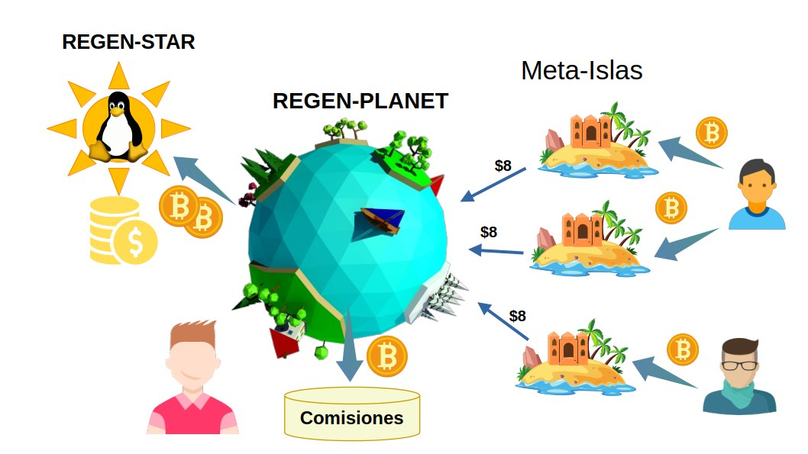

# Regen-Star : Organización que Respalda Esfuerzos Colectivos

En FREEDERATION, los proyectos dedicados al mantenimiento del Software Libre se convierten en **Regen-Stars**, que operan como Franquicias de Responsabilidad Mutua.

Cada **Regen-Star** establece un pacto de membresía con las **Meta-Islas** y **Regen-Planets** a su cargo:

- Para las Meta-Islas afiliadas, la organización de la Regen-Star respalda sus compromisos en la preservación de la Calidad de la Información en redes sociales descentralizadas, como **Nostr**. A cambio, las Meta-Islands contribuyen a la sostenibilidad del proyecto de Software Libre, recaudan fondos de los patrocinadores que invierten en la promoción de sus contenidos.
- De manera similar, los Regen-Planets gestionan la afiliación de las Meta-Islas que operarán en representación de la Regen-Star, asumiendo la responsabilidad por su futuro desempeño en el respaldo de compromisos y moderación de contenidos. A cambio de su gestión, obtienen comisiones de ventas por afiliación.
___

___

Esta relación de beneficio mutuo implica un pacto de responsabilidad, en el que la organización liderada por la Regen-Star debe velar por el comportamiento íntegro de las Meta-Islas bajo su tutela. Asimismo, los operadores de las Meta-Islas tienen poder de voto dentro de la organización.

## Fundación de la Regen-Star

Las Regen-Star son creadas con base en la representación de un proyecto Open Source existente, o en su defecto un proyecto de desarrollo de contenidos digitales de dominio público.

Para crear una Regen-Star desde cero, el fundador necesita acuñar un **Nucleus-Token** desde la DAO de FREEDERATION. Gastando un token de **Nucleus-Token**, el fundador registra su Regen-Star aportando detalles básicos sobre su proyecto Open Source y perfíl de **Nostr**.

| Atributo        | Descripción                                                                 |
|-----------------|-----------------------------------------------------------------------------|
| **name**       | Identificador del proyecto  |
| **projectURL**       | URL del repositorio github o sitio web                |
| **NostrAccount**      | Dirección de 32 bytes del perfil de Nostr   |
| **TargetAddress**   | Dirección de crypto-billetera para autorizar el control del proyecto.     |

Luego de inscribir el proyecto Open Source como una Regen-Star, el fundador puede iniciar una venta inicial de tokens del proyecto brindará a los Early Adopters adquirir un **Regen-Planet** del proyecto y beneficiarse a futuro de la venta de **Meta-Islas**. Véase el capítulo de los **Regen-Planets** para mas detalles sobre la venta inicial a los Early Adopters.

Sin embargo, en su fase inicial la Regen-Star buscará su **Acreditación** para activar su función de recaudo y expansión de la franquicia. El Prestigio no se desarrolla aún y se mantiene la organización en un estado latente (NEBULOUS) para ser promovida y aprobada por la DAO de FREEDERATION. 

## Administración de Fondos

La Regen-Star mantiene un fondo común del cuál destinan un porcentaje a financiar tareas de desarrollo y mantenimiento del repositorio del software de código abierto. 

Otro porcentaje se destina a la conformación de un **Fondo de Cobertura de Riesgos** para sustentar demandas en los tribunales: en caso de que se verifique su negligencia en el cumplimiento de sus obligaciones relacionadas con la preservación de la calidad e integridad de la organización.

En un futuro el **Fondo de Cobertura de Riesgos** también se utilizará para respaldar pólizas de aseguramiento en servicios de ciberseguridad.

## Prestigio de la Regen-Star

FREEDERATION cuenta con mecanismos participativos para evaluar el desempeño e integridad de las organizaciones representadas por sus Regen-Stars. Por lo tanto, los miembros dentro de estas organizaciones deben velar por la reputación colectiva del proyecto.

Dicha reputación colectiva de la Regen-Star se denomina **Prestigio**. Y éste puntaje se actualiza periódicamente (el tiempo establecido por el parámetro **VestingPeriod** )  cuando la organización a cargo de la Regen-Star tramita su promoción en la DAO de FREEDERATION a cambio de un pago establecido (Cuota de Promoción).

Por otro lado, el puntaje de Prestigio puede ser afectado negativamente por las sanciones que se apliquen sobre la Regen-Star en caso de ser acusadas en el **Tribunal de Arbitraje**.

El puntaje de **Prestigio** se usa como factor para el cálculo de la Reputación individual de cada **Meta-Isla**, lo que favorece su valor de mercado para los patrocinadores (**Sponsors**).

Las Regen-Star manifiestan una evolución desde su creación y durante su desempeño en la labor de mantener una comunidad y financiar el desarrollo de los proyectos de Software Libre. Si su gestión es satisfactoria y diligente, su **Prestigio** aumentará con el pasar del tiempo.

Es decir, que el **Prestigio** de una Regen-Star está directamente relacionado con su antigüedad y constancia en su labor de mantenimiento.

Por otro lado, una Regen-Star puede reducir su Prestigio cuando se determina su responsabilidad en las faltas cometidas por alguna de sus **Meta-Islas** a cargo, o bien por negligencia en el desarrollo y mantenimiento del proyecto Open Source bajo su gestión.

### Ciclo de vida de la Regen-Star

En el momento de su creación por parte del fundador, la Regen-Star se mantiene en un estado latente pero inactivo, denominado NEBULOUS. En este estado, el fundador procede a realizar una venta inicial de Regen-Planets a los Early-Adopters para recaudar fondos y acreditar el proyecto en la gobernanza de la DAO de FREEDERATION.

Su ciclo de vida muestra las diferentes etapas por las que pasa una Regen-Star, desde su creación hasta su posible redención después de cometer una falta:

1. **NEBULOUS**: La Regen-Star es creada y permanece en este estado inicial. Desde aquí, puede ofrecer una Oferta Inicial de Tokens de Regen-Planets para obtener fondos y tramitar su promoción. Durante ésta fase, no se producen Meta-Islas.

2. **PROMOTING**: Cuando la Regen-Star obtiene suficientes fondos para pagar la **Cuota de Acreditación**, pasa al estado de PROMOTING. En este estado, busca la aprobación mediante votación en la Lotería de Promoción celebrada cada VestingPeriod. Si resulta la opción elegida del ganador, pasa a convertirse en ACCREDITED.

3. **ACCREDITED**: Si la Regen-Star recibe suficientes votos para su aprobación en la Lotería de Promoción, se convierte en ACCREDITED y puede desarrollar sus actividades económicas. Es también la fase en la cuál una Regen-Star puede producir Meta-Islas. Durante este estado, aumenta su Prestigio.

4. **GUILTY**: Si la Regen-Star es acusada de cometer una falta y romper sus compromisos, es sancionada y pasa al estado GUILTY. Durante éste estado se bloquean las comisiones y no se pueden crear nuevas Meta-Islas o Regen-Planets.

5. **REDEEMED**: Una Regen-Star que entra en estado GUILTY puede ser redimida y perdonada por el comité de votación, pagando una **Tarifa de Absolución**. Si el comité de votación vota a favor de su absolución en el Tribunal de Arbitraje, la Regen-Star se convierte en REDEEMED. En este estado puede crear Meta-Islas y recaudar fondos.

Desde un punto de vista funcional, la Regen-Star tiene 2 etapas principales en su desarrollo. 
- Se dice que está en etapa de **Incubación**, cuando es creada y busca su acreditación para expandir y desempeñar labores de aseguramiento de compromisos. Durante su etapa de **Incubación**, la Regen-Star no puede producir Meta-Islas ni tampoco recaudar fondos de los sponsors. Tampoco puede desarrollar Prestigio ni ser juzgada en los Tribunales de Arbitraje.
- Una vez es aprobada por la gobernanza como un proyecto legítimo, la Regen-Star adquiere la facultad de estar **Acreditada**  y empieza su desarrollo progresivo adquiriendo **Prestigio** en sus actividades comerciales. Durante ésta fase puede crear membresías a través de las Meta-Islas y expandir la franquicia.

### Acreditación de las Regen-Star

La DAO de FREEDERATION establece un mecanismo de sorteo participativo, en el cuál se selecciona al azar a los jurados que votarán positivamente para favorecer a las **Regen-Star** en estado PROMOTING que se han postulado. Este mecanismo se conoce como **Lotería de Promoción**.

Análogamente, una Regen-Star existente que ya esté Acreditada (ACCREDITED) puede promover directamente a otra Regen-Star en fase de incubación (NEBULOUS o PROMOTING), pero al hacerlo comparte la responsabilidad sobre su futuro desempeño afectando su Prestigio derivado.

### Desarrollo de Prestigio

Una vez una Regen-Star ha sido promovida y acreditada, puede desarrollar su Prestigio a medida que su organización desempeña correctamente las siguientes funciones:

1) Administrar los fondos recaudados para financiar las tareas correspondientes al mantenimiento y desarrollo del Software Libre. O bien para apoyar labores en beneficio de su comunidad.

2) Velar por el buen comportamiento de sus Meta-Islas asociadas, en el ejercicio de la moderación cuando éstas promuevan información engañosa, fraude o contenido malicioso.

La DAO de FREEDERATION establece un procedimiento por el cuál una Regen-Star tramita el incremento de su Prestigio, pagando una Cuota de Promoción que contribuye al Fondo de Gobernanza después de un periodo determinado, el denominado VestingPeriod.

El parámetro de la **Cuota de Promoción** es fijado en la gobernanza de FREEDERATION como la mínima contribución que una Regen-Star debe aportar del  impuesto sobre las actividades comerciales dentro de la Regen-Star. El recaudo de impuestos se destina al Fondo de Gobernanza.

Cada **VestingPeriod**, la **Regen-Star **que tramita su promoción aumenta su **Prestigio** según la siguiente fórmula:

[$% \text{Prestige}_{n+1} = \text{Prestige}_{n} + 1 + SponsorshipBonus %$]

Donde **SponsorshipBonus** es una variable de estado que puede valer [0, 1,  2], y está relacionada con el patrocinio entre Regen-Stars.

### Madurez y Patrocinio entre Regen-Stars

Se considera que una Regen-Star ha alcanzado su **Estado de Madurez** cuando su **Prestigio** supera el umbral denominado **MaturityThreshold**. Por defecto, éste umbral corresponde a 8 **VestingPeriods**.

Al superar este umbral, la Regen-Star adquiere la capacidad de promover directamente a otras Regen-Star en estado de **Incubación** (NEBULOUS. PROMOTING):
- El incentivo para promover Regen-Stars en incubación es obtener un punto (1) en la variable **SponsorshipBonus**, lo que permite incrementar su **Prestigio** más rápidamente.
- Sin embargo, el costo de promover otros proyectos es compartir la responsabilidad en caso de sanciones en los **Tribunales de Arbitraje**.
- La Regen-Star en **Estado de Madurez** que promueva otras Regen-Star debe cubrir parte de las indemnizaciones cuando algunas de las Regen-Star bajo su tutela no puedan afrontar sus sanciones con su propio **Fondo de Cobertura de Riesgos**. En tales casos, se resta 1 punto de **Prestigio** tanto a la patrocinadora como a la sancionada bajo su tutela, y se pierde el privilegio de **SponsorshipBonus** para siempre asignándose el valor a 0.
- Una vez que las Regen-Stars patrocinadas alcanzan su umbral de **Madurez**, se emancipan de su Regen-Star patrocinadora y ya no comparten la responsabilidad en los **Tribunales de Arbitraje**. Esto aumenta el puntaje **SponsorshipBonus** de la Regen-Star patrocinadora a 2.

### Tribunales y afectación del Prestigio

Los otros mecanismos que afectan el puntaje de Prestigio para la Regen-Star se basan en un sistema de votación y sorteo aleatorio orquestado por la DAO de FREEDERATION, concertado periódicamente por la gobernanza del sistema donde participan las Meta-Islas de todos los proyectos. Estos mecanismos son:

1) **Lotería de Promoción**: El sorteo aleatorio elige a una **Meta-Isla** ganadora que determinará cuál Regen-Star en fase de incubación (PROMOTING) merece ser Acreditada para desarrollar su actividad económica y así desarrollar su **Prestigio**.

2) **Tribunal de Arbitraje**: La Meta-Isla ganadora de la Lotería de Promoción elige un caso del banco de acusaciones abiertas contra los proyectos.  A partir del caso seleccionado determina su veredicto sobre si aplicar o absolver a la entidad acusada. 

Ya sea por negligencia al no ejercer la supervisión y moderación sobre las actividades de las Meta-Islas, o errores en la gestión del proyecto de Bienes Públicos, una Regen-Star podría afrontar penalizaciones como la reducción de su puntaje de Prestigio, sanciones económicas y también restricciones en su ejercicio de recaudo.