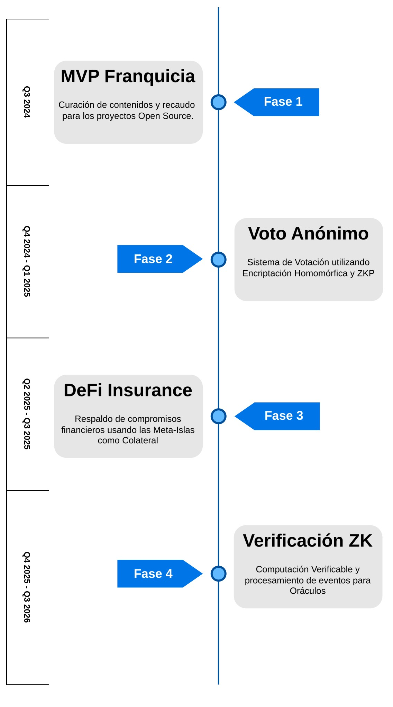

# Hoja de Ruta (ROADMAP)

El plan de desarrollo de FREEDERATION contempla partir de la estructura del modelo de Franquicias de Aseguramiento representas con las Regen-Star y sus Meta-Islas asociadas, hacia protocolos de aseguramientos de compromisos en la blockchain. 

1. En la primera iteración, se consolida la plataforma para la curación de contenidos y el recaudo de fondos para apoyar a los proyectos Open Source.
2. En la siguiente fase, se desarrollará el mecanismo de Voto Anónimo para la verificación de hechos con respecto a la gestión de calidad ejercido por las Meta-Islas y los administradores del proyecto Open Source en las Regen-Star.
3. Se construirán aplicaciones para el respaldo de compromisos financieros y préstamos usando las Meta-Islas como colateral para respaldar los contratos.
4. En futuras fases, se construirá una plataforma de Cómputo Verificable (con criptografía ZK) para el procesamiento de información de los eventos de Nostr y el contenido digital realizado por los usuarios. Lo que permitirá desarrollar la infraestructura de los Oráculos de Información basados en Verificación de Hechos.

