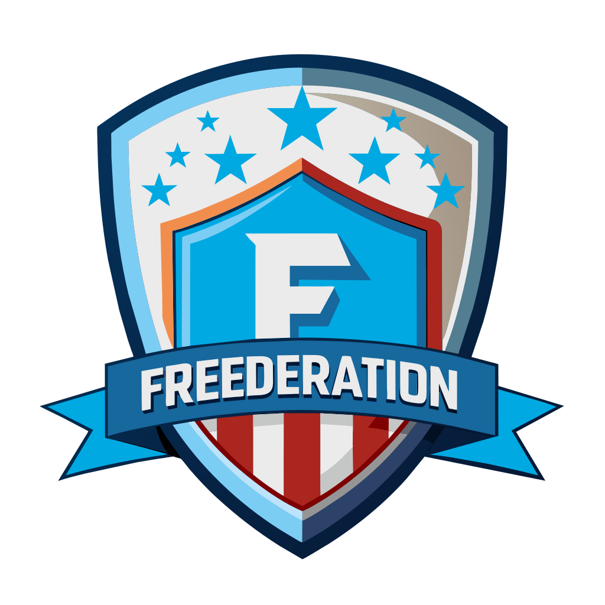

# Qué es FREDERATION?

**FREEDERATION** es una plataforma de comunidades DAO que brinda sustento económico a los proyectos **Open Source** (Software Libre y Obras Intelectuales de Dominio Público).

Este protocolo establece mecanismos de economía colaborativa en las actividades de preservación de la **Intergridad de la Información**, facilitando mecanismos de recomendación y búsquedas categóricas en redes sociales descentralizadas como **Nostr**.

En ésta plataforma, los proyectos de desarrollo de bienes públicos se transforman en Franquicias Open Source, involucrando a sus  agentes asociados en el negocio de la Curación de Contenido y Respaldo de Compromisos en la blockchain.
