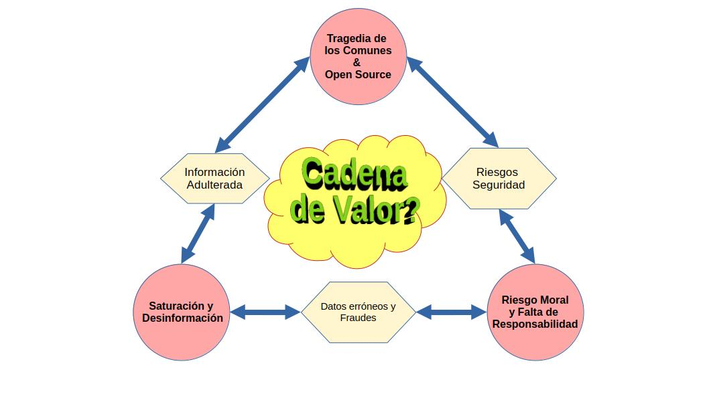

# Motivación

La era digital actual enfrenta numerosos desafíos, entre ellos las amenazas cibernéticas, la desinformación y la falta de integridad en las operaciones digitales.

La falta de mantenimiento del software libre es un factor crucial que agrava estos problemas, exponiendo a usuarios y organizaciones a vulnerabilidades cibernéticas. Esto facilita la propagación de información errónea y fraudes en línea.

Además, las fallas en la información dificultan la toma de decisiones informadas y comprometen la fiabilidad de las aplicaciones blockchain. Esto puede desencadenar adulteraciones en los protocolos DeFi, brechas de seguridad y cuantiosas pérdidas económicas.

Por lo tanto, es fundamental establecer una cadena de responsabilidad clara entre los encargados del mantenimiento de la infraestructura computacional y los beneficiarios de las economías digitales.