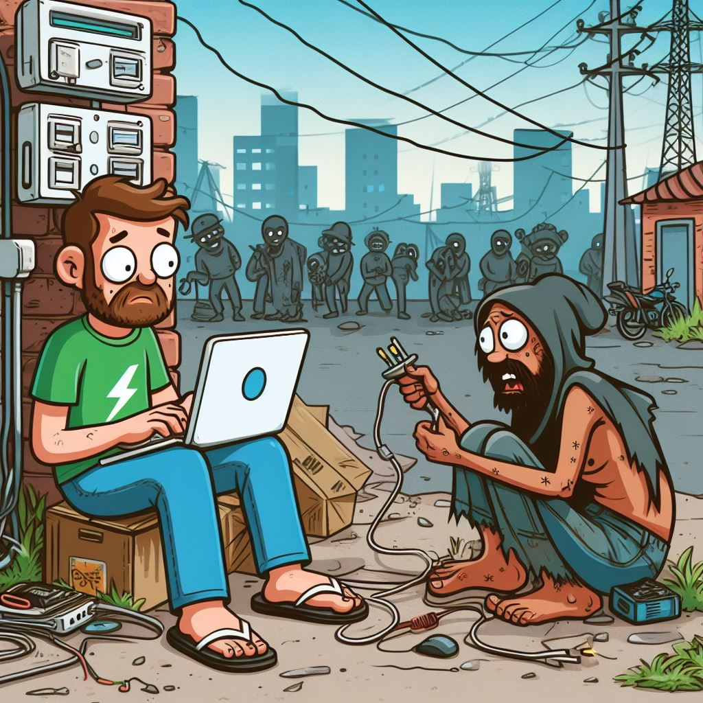

## Sostenibilidad de la Infraestructura de la Web Descentralizada

El éxito de una plataforma de comunidades temáticas en la red social **Nostr** no solo depende de la calidad de sus herramientas de software, sino también de la seguridad y sostenibilidad de la infraestructura subyacente. 

Fortalecer la seguridad de la infraestructura computacional y asegurar la sostenibilidad de los esfuerzos en el desarrollo de tecnologías web y blockchain son pasos cruciales para garantizar la efectividad de las estrategias que promueven la integridad de la información en redes sociales descentralizadas.

Cabe destacar que estos esfuerzos no pueden realizarse aislados de la realidad económica que rodea al desarrollo de **Open Source** (software de código abierto), un componente fundamental de la Web Descentralizada. La falta de un modelo económico viable para el Open Source dificulta la asignación de responsabilidades para su desarrollo y mantenimiento, lo que a su vez genera serios problemas de seguridad y confiabilidad en los sistemas informáticos.