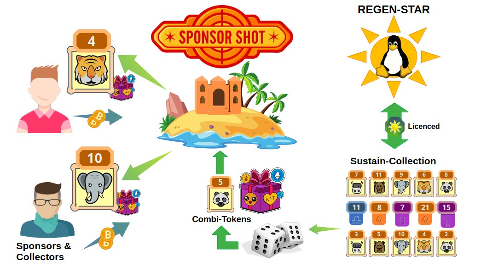
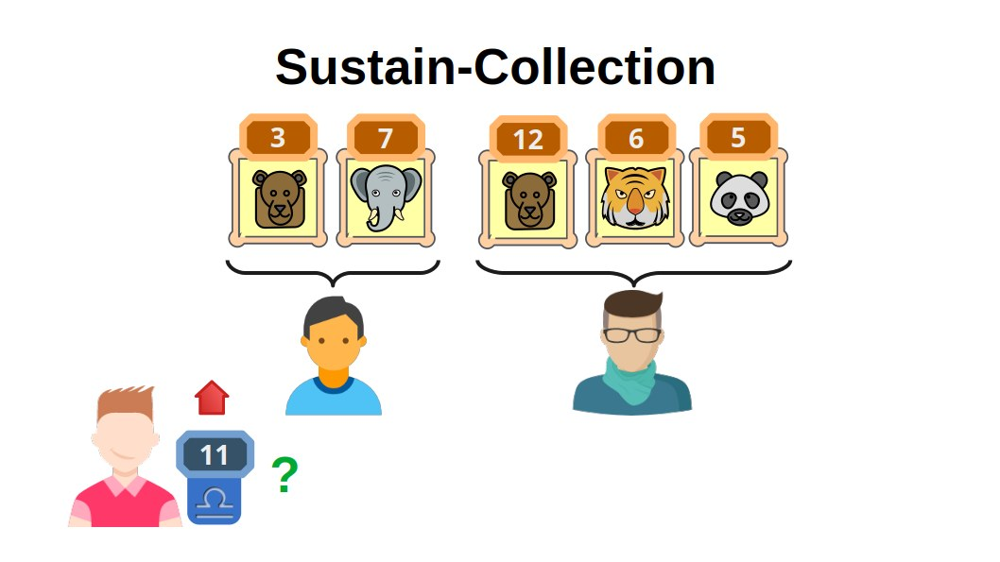
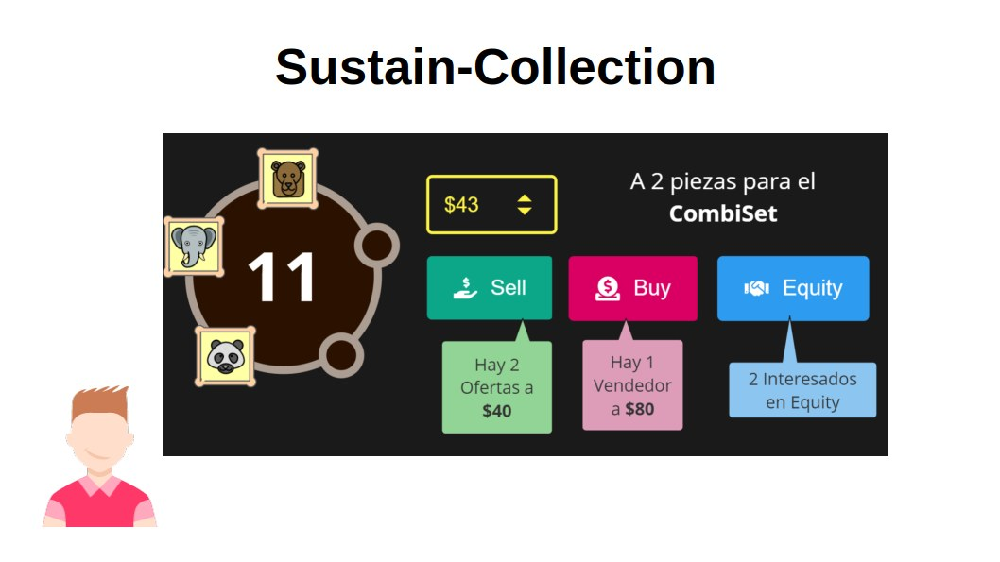
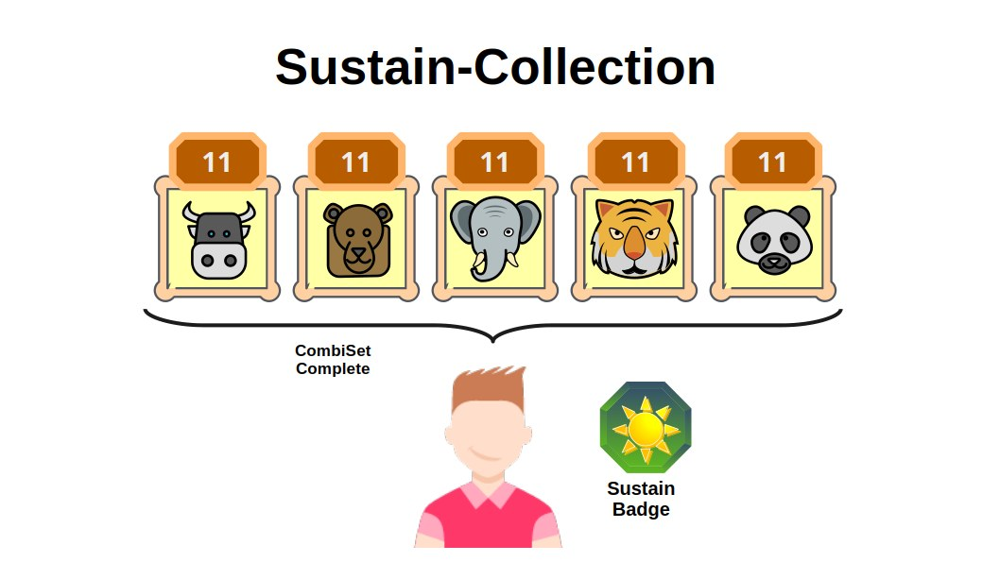

# Licenciamiento de las Sustain-Collection

Bajo el amparo de las Regen-Star, los artistas registran y licencian un proyecto de NFTs usando el formato de una **Sustain-Collection**.

- A través del proceso de interacción conocido como **SponsorShot**, cada **Meta-Isla** puede emitir varios **Combi-Tokens** generados aleatoriamente a partir de los parámetros definidos en las **Sustain-Collection** previamente registradas dentro de la **Regen-Star**, al cuál la Meta-Isla está asociada.
- Cada **Sustain-Collection** define un conjunto limitado de piezas agrupado para una combinación finita **CombiSet**, y un número de Serie. 
- Los coleccionistas tendrán incentivos para completar los **CombiSet**, reuniendo los **Combi-Tokens** que corresponden a la combinación finita y la misma Serie.
___

___

Un ejemplo de cómo se configuran los parámetros de una **Sustain-Collection**, es una colección de 5 piezas de diseños de diferentes pero bajo la misma temática, y según los parámetros de la Sustain-Collection se han de emitir hasta 20 números de Serie para cada combinación. 

___

___

Es decir, los artistas determinan el conjunto de piezas que completan un **CombiSet**, y por cada tipo de pieza del grupo le corresponden 20 números de serie.

Cuando los usuarios  adquieren los **Combi-Tokens** a través del proceso **SponsorShot**, se les generan de manera aleatoria un grupo de piezas del conjunto total de combinaciones posibles entre serie y pieza del grupo **CombiSet**.

___

___

Tal distribución aleatoria de piezas entre coleccionistas brinda incentivos para intercambiar los tokens con otros usuarios en la plataforma. 
FREEDERATION brinda herramientas para facilitar la coordinación entre vendedores y compradores de piezas, con la posibilidad de establecer acuerdos de asociación para gestión compartida de los premios correspondientes a **CombiSets** completados.

La meta es completar las piezas de un **CombiSet** correspondiente al mismo número de serie, para obtener un galardón especial, el Sustain-Badge que otorga al portador ciertos derechos especiales dentro del Regen-Star, a convenir por la comunidad. 
___

___

