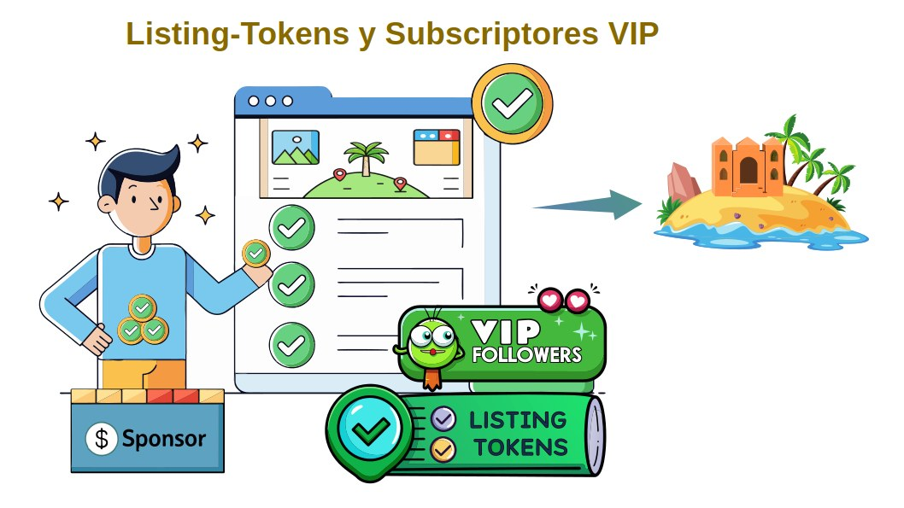

# Listing-Tokens y SponsorAccounts

Los **Listing-Tokens** son tokens semi-fungibles que los **Sponsors** adquieren a través del proceso de **SponsorShot**. Estos tokens permiten a cada patrocinador inscribir su cuenta de **Nostr** en la lista de suscriptores destacados en las **Meta-Islas**, garantizándoles aparecer en los primeros lugares de búsqueda de trending topics.

Cada **Meta-Isla** mantiene una lista de suscripción de seguidores, quienes pueden influir en las búsquedas sugeridas a los clientes que consulten esa Meta-Isla según su criterio temático.

___

___

Los **Sponsors** pueden ocupar un lugar privilegiado en la lista de seguidores utilizando los **Listing-Tokens** para registrarse como **Suscriptores VIP**:

1. **Adquisición de Listing-Tokens**: Un **Sponsor** obtiene un paquete de **Listing-Tokens** mediante el proceso de **SponsorShot** (una cantidad fija, por defecto 5 tokens). Estos tokens semi-fungibles están ligados al proyecto **Regen-Star**, al cual pertenece la Meta-Isla.
2. **Registro como Suscriptor VIP**: El **Sponsor** gasta cada token para registrarse en la lista de suscriptores importantes de las **Meta-Islas** de su elección.
3. **Mejora de Visibilidad**: Los internautas que interactúen con el cliente **Nostr** de **FREEDERATION** recibirán en su feed las publicaciones sugeridas provenientes de los **Suscriptores VIP** de las **Meta-Islas** de su elección, aumentando la visibilidad de los **Sponsors**.

Cabe resaltar que para registrarse como **Suscriptores VIP** en las Meta-Islas, los usuarios patrocinadores necesitan activar su cuenta de Sponsor en FREEDERATION por primera vez.

Gastando un monto equivalente a 3 Listing-Tokens, un usuario obtendrá a cambio un NFT de **SponsorAccount** asociado a su cuenta de Nostr.

Los beneficios de obtener un **SponsorAccount** incluyen mejorar la visibilidad en sus publicaciones y resaltar su participación en las discusiones, con funcionalidades añadidas para motores de búsqueda y recomendación por temáticas.
