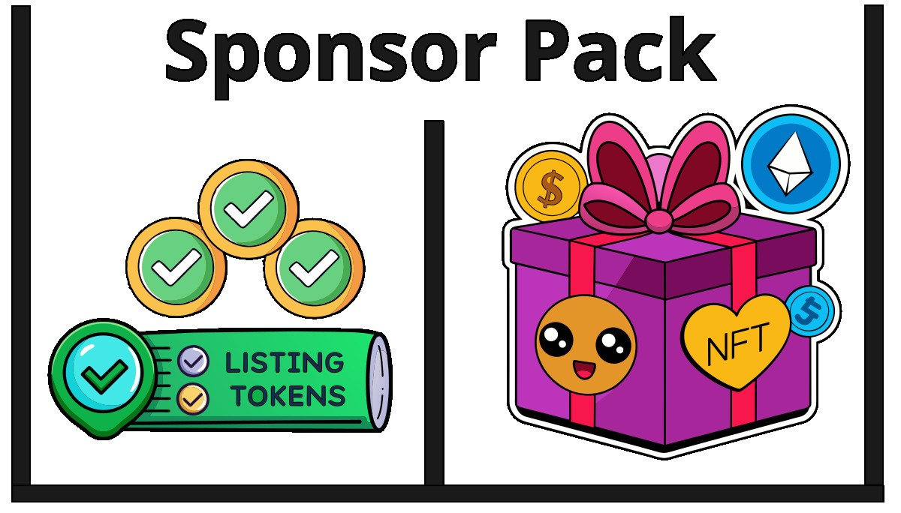

# Tokens de Participación Comunitaria

FREEDERATION revolucionará el mundo del código abierto al establecer una plataforma innovadora para la distribución de NFTs con utilidad concreta para las comunidades Open Source. 

En el corazón de esta plataforma se encuentra el mecanismo de **SponsorShot**, una ingeniosa herramienta mediante la cual las Meta-Islas asociadas a una Regen-Star acuñan y dispensan NFTs de manera aleatoria a los coleccionistas.

Durante el proceso de **SponsorShot**, se recaudan fondos y se produce un conjunto denominado **SponsorPack**, el cual consiste en un paquete compuesto por 5 **Listing-Tokens** y un grupo aleatorio de Combi-Tokens.

___

___

Este mecanismo no solo proporciona emocionantes oportunidades para los entusiastas de los NFTs, sino que también permite a los patrocinadores obtener los **Listing-Tokens**: útiles para destacar sus publicaciones y posicionan su contenido en la red social Nostr.
Además, FREEDERATION abre un nuevo horizonte de posibilidades para los coleccionistas, quienes tienen la oportunidad de intercambiar piezas únicas, enriqueciendo así su experiencia y colección personal. 

Esta plataforma no solo se enfoca en la distribución de NFTs, sino que también gamifica la experiencia del usuario, generando incentivos que fomentan la participación y el sentido de comunidad entre los miembros.
Con FREEDERATION, el mundo del código abierto y los coleccionistas de NFTs encuentran un punto de convergencia, donde la tecnología de vanguardia y la colaboración comunitaria se unen para crear un ecosistema dinámico y vibrante.
