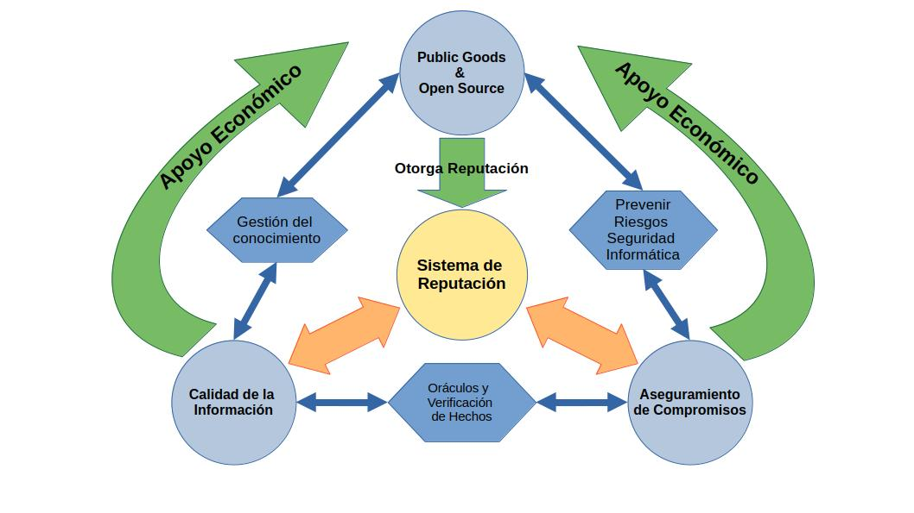

# Propuesta de Valor

**FREEDERATION** es una plataforma que permite a proyectos Open Source establecerse como instituciones de aseguramiento. Esto se logra aprovechando el prestigio de los proyectos para respaldar los compromisos de sus miembros asociados, los Agentes Aseguradores. Estos monetizan su conocimiento y experiencia mediante la **Curación de Contenidos**.

FREEDERATION es una plataforma que permite a proyectos Open Source establecerse como instituciones de aseguramiento. Esto se logra aprovechando el prestigio de los proyectos para respaldar los compromisos de sus miembros asociados, **los Agentes Aseguradores**. 

Estos agentes monetizan su conocimiento y experiencia mediante la Curación de Contenidos para facilitar estratégias de **Marketing Responsable** en redes descentralizadas como **Nostr**.
