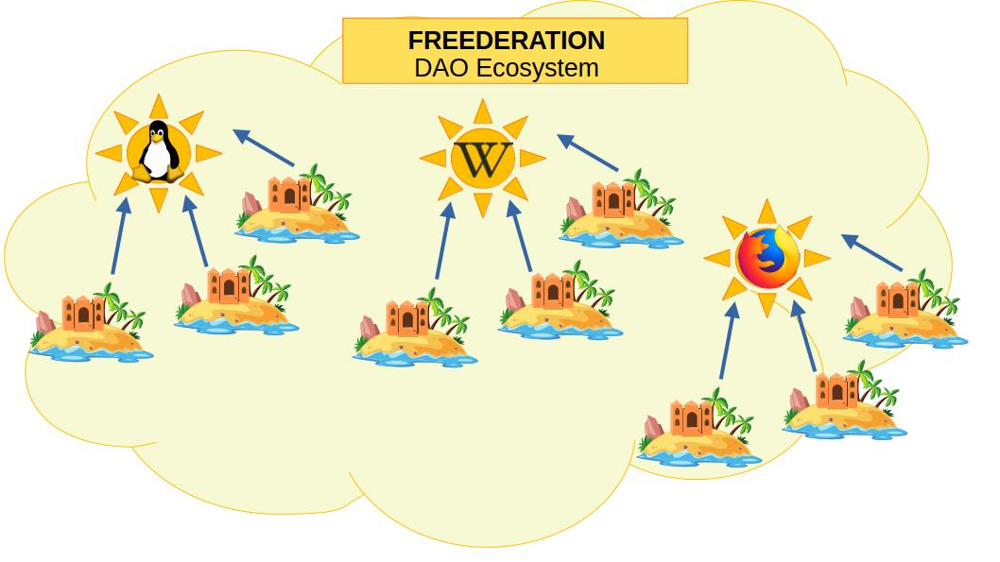

## Reputación como Valor Intrínseco

**FREEDERATION** otorga a los proyectos **Open Source** la facultad de establecerse como instituciones de aseguramiento que garantizan el respaldo de compromisos de sus miembros asociados.

La capacidad de respaldar compromisos se fundamenta en el valor intrínseco de los proyectos **Open Source**, el cual consiste en el **Prestigio** que los desarrolladores consolidan al cumplir las expectativas de la comunidad de sus usuarios.

Tal **Prestigio** aumenta en la medida que cumplan las metas de calidad del software o creación digital. Usando su respaldo institucional, la organización del proyecto Open Source adquiere la facultad de otorgar Reputación a las agencias de aseguramiento asociadas en su esquema.

En ese orden de ideas, **FREEDERATION** establece un pacto de asociación entre los proyectos **Open Source** y las agencias aseguradoras bajo el modelo de Franquicia: El proyecto Open Source expande su influencia como marca y bajo su **Prestigio** respalda los compromisos adquiridos por sus socios miembros de la institución, las **Agencias Aseguradoras**.

A cambio de su respaldo institucional, los franquiciados (Agencias Aseguradoras) retribuyen parte de sus ingresos a la franquicia aseguradora. Es decir, por cada venta de pólizas de seguros se contribuye una prima base a la organización gestora (la franquicia) y del excedente corresponde al franquiciado una comisión de venta.

Las **Agencias Aseguradoras** se desempeñan no solo en el respaldo de compromisos entre agentes económicos, sino también en labores de preservación de la información. Tales labores son cruciales para la Moderación de Contenidos y el **Marketing Responsable** en redes descentralizadas como **Nostr**.

En síntesis, **FREEDERATION** permite aprovechar el prestigio de los proyectos Open Source para autorizar a los franquiciados (Agencias Aseguradoras) ejercer los servicios que requieran un respaldo contractual usando su Reputación y membresía  de la franquicia como colateral.
