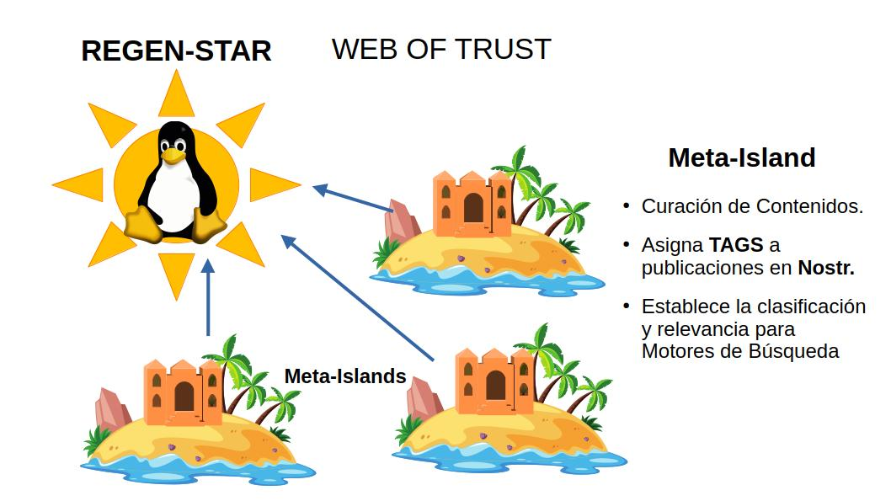

## Organización de la Franquicia

**FREEDERATION** establece un modelo de Franquicia de Aseguramiento para que los proyectos **Open Source** conformen una red de agentes asociados que venderán servicios en nombre de la organización y así recaudarán los fondos para la gestión del proyecto.

Para ello, se emplea la analogía de un sistema solar, donde el proyecto Open Source se representa como una Estrella, la **Regen-Star**. 
A partir de la **Regen-Star**, se derivan los planetas (**Regen-Planets**) que ejercerían como Agentes de Afiliación: Es decir, cada **Regen-Planet** constituye un tipo especial de agente asociado en la organización Regen-Star que gestionan la membresía de los nuevos agentes franquiciados.

Por otro lado, los agentes franquiciados adquirirán una Agencia Aseguradora: las **Meta-Islas** son un tipo de activo no fungible que los autoriza a operar servicios en nombre del proyecto Open Source representado en la **Regen-Star**.

Las **Meta-Islas** son las agencias aseguradoras en el Metaverso de FREEDERATION. Estas agencias venden pólizas de aseguramiento y servicios de curación de contenidos relevantes.

Su misión es garantizar la integridad de la información en sistemas de computación distribuida. De manera análoga, las **Meta-Islas** catalogan contenidos y filtran información relevante para ayudar al desarrollo de motores de búsqueda y la promoción de canales temáticos.