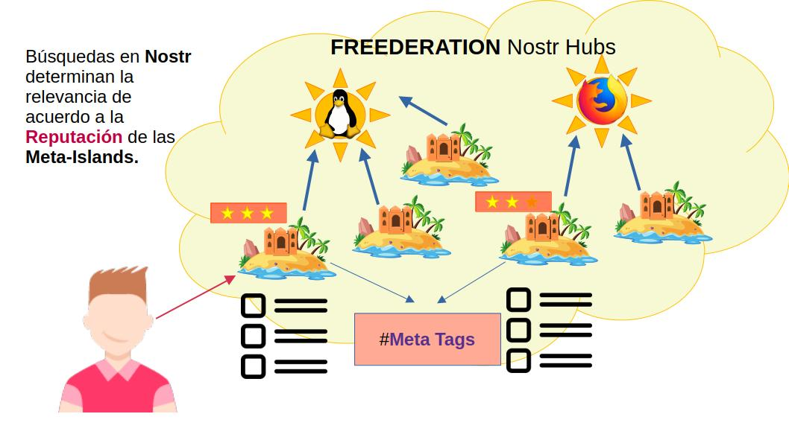

## Curación de Contenido y Marketing Responsable

Las comunidades temáticas en la red social Nostr requieren un modelo organizacional que estructure un negocio dedicado a la catalogación de publicaciones y contenidos Este modelo no solo debe ser capaz de gestionar la calidad de la información, sino que también debe generar ingresos para respaldar el desarrollo de Software Libre, una pieza fundamental en la infraestructura de la web descentralizada.

Como una plataforma DAO de aseguramiento de compromisos, **FREEDERATION** se enfoca en el desarrollo de herramientas para construir comunidades temáticas. Para ello establece una administración responsable de los índices de clasificación de contenidos y estrategias orgánicas de moderación basadas en criterios comunitarios.

En el corazón de este modelo se encuentra la implementación de mecanismos de arbitraje para la moderación de contenidos, los cuales se apoyan en un Sistema de Reputación como pilar fundamental: Aquí es donde los proyectos de Software Libre juegan un papel crucial, otorgando reputación a los agentes económicos del modelo organizacional a cambio del apoyo económico que proporcionan.

**FREEDERATION** establecen mecanismos de **Marketing** Responsable a través de la monetización del servicio de Curación de Contenidos, llevado a cabo por los Agentes de la Franquicia de Aseguramiento. Estos agentes se encargan de categorizar los contenidos, ejerciendo su labor dentro de las Meta-Islas asociadas a una Regen-Star.

De esta manera, **FREEDERATION** incentiva a los patrocinadores a invertir en las **Meta-Islas**, terrenos virtuales del metaverso que representan las cuentas influyentes especializadas en las temáticas y categorías sobre las cuales han de enfocar los esfuerzos de Marketing Responsable. 

La interacción entre patrocinadores (Sponsors) y las Meta-Islas se describe a continuación:

1) Nuevas aplicaciones compatibles con el protocolo Nostr contarán con los servicios de la plataforma de **FREEDERATION** para encontrar a las cuentas responsables de categorizar el contenido. 
2) Las **Meta-Islas** desarrollarán su Reputación al asumir el rol de Curadores de Contenido mediante la administración de una cuenta especial en Nostr. 
3) A medida que relacionan contenidos, publicaciones y direccionan otras cuentas de Nostr basándose en su relevancia temática, adquieren influencia y prestigio que atraerá el interés de los anunciantes o **Sponsors**.
4) Los **Sponsors** elegirán a las **Meta-Islas** más relevantes de acuerdo a las temáticas de sus campañas, y procederán a establecer un acuerdo económico con las Meta-Islas para promover contenidos a cambio de una comisión. Este mecanismo se conoce como **SponsorShot**.
5) Mediante el proceso de **SponsorShot**, los anunciantes proponen sus contenidos a ser categorizados pagando una comisión por el servicio, el cual puede ser atendido por la Meta-Isla a discreción, según convenga y sometiéndose a las políticas de la comunidad. Véase el capítulo de **SponsorShot** para mas información.