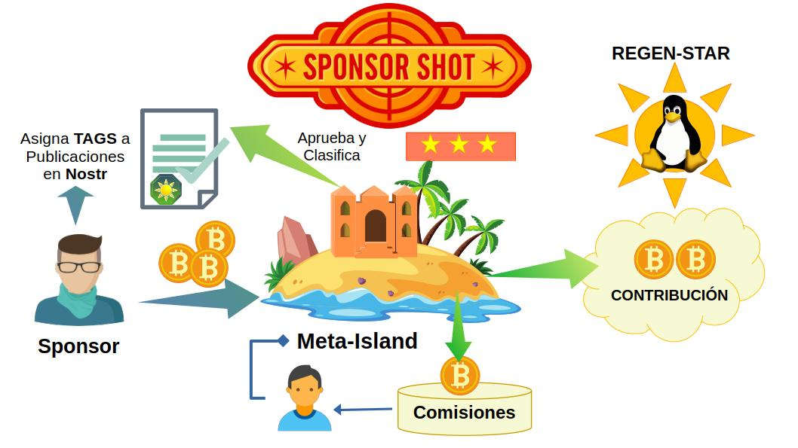

## Valor Agregado para los Patrocinadores (Sponsors)

A través del proceso de **SponsorShot**, el Patrocinador obtiene las herramientas para destacar sus publicaciones y conectarse con su audiencia. Tales herramientas permiten que los motores de búsqueda relacionen su información de acuerdo a la relevancia temática en la cuál clasifica sus contenidos y oferta de valor.

El resultado del proceso consiste en la obtención de unos tokens y el servicio de referenciación ejercido por la **Meta-Isla**:
  - La adquisición de un número finito de **Listing-Tokens** que el patrocinador usará para registrarse en la lista de subscriptores VIP en las **Meta-Islas** de su elección. Los motores de búsqueda usarán ésta lista de subscriptores para explorar contenidos asociados a las categorías de la Meta-Isla.
  - Un paquete de NFTs generados aleatoriamente, los **Combi-Tokens**, los cuales corresponden a colecciones licenciadas por la **Regen-Star** (**Sustain-Collections**). Estos **Combi-Tokens** corresponden a recompensas de la comunidad, artículos de juegos o tickets de eventos. También se utilizan para destacar publicaciones y representar insignias en el perfil de Nostr.
  - Adicionalmente, a cambio de una Comisión Condicionada la **Meta-Isla** hará mención de un artículo o publicación propuesta por el Patrocinador para facilitar su búsqueda semántica y mejorar el desempeño del motor de recomendaciones a su público objetivo.

En resumen, el proceso de **SponsorShot** establece un mecanismo flexible donde el **Patrocinador (Sponsor)** y la **Meta-Isla** gestionan la forma en la que se hará mención de la publicación a referenciar en el feed de mensajes de la cuenta de Nostr asociada a la **Meta-Isla**. De esa manera se facilitan las búsquedas en la red social Nostr.